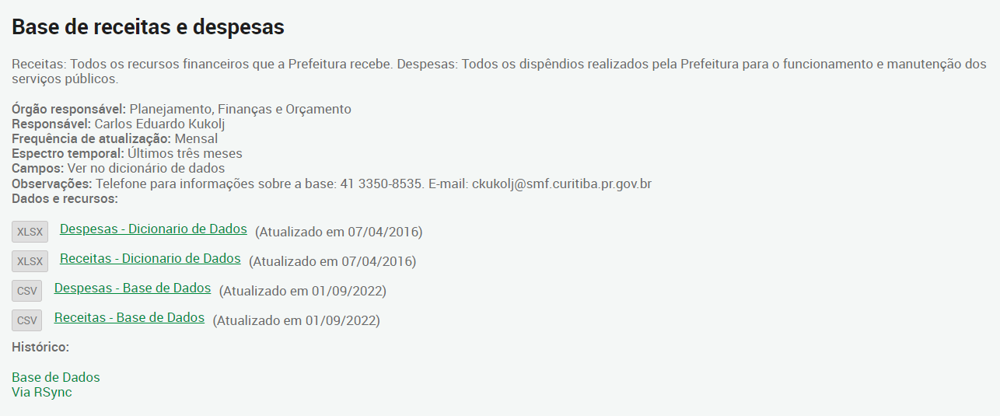

  

  <h3 align="center">
    base_de_despesas
  </h3>
  

    <a href="https://github.com/viniciusgugelmin/data-science/blob/master/README.md"><strong>Explore the docs »</strong></a>
  

  
<h2 style="display: inline-block">📜 Abstract</h2>

- [About The Project](#about-the-project)
- [Source](#source)

## 📋 About The Project

**(Portuguese)**

Todos os dispêndios realizados pela Prefeitura de Curitiba para o funcionamento e manutenção dos serviços públicos.

**(English)**

All expenditures made by the City of Curitiba for the operation and maintenance of public services.

## 🔗 SOURCE

**(Portuguese)**

- **Nome original do projeto**: Base de receitas e despesas
- **Disponível em**: https://www.curitiba.pr.gov.br/dadosabertos/busca/?pagina=2
- **Baixado em**: 15/09/2022 13:36:15
- **Imagem**:
  

**(English)**

- **Original project name**: Receipts and expenses base
- **Available at**: https://www.curitiba.pr.gov.br/dadosabertos/busca/?pagina=2
- **Downloaded at**: 09/15/2022 13:36:15
